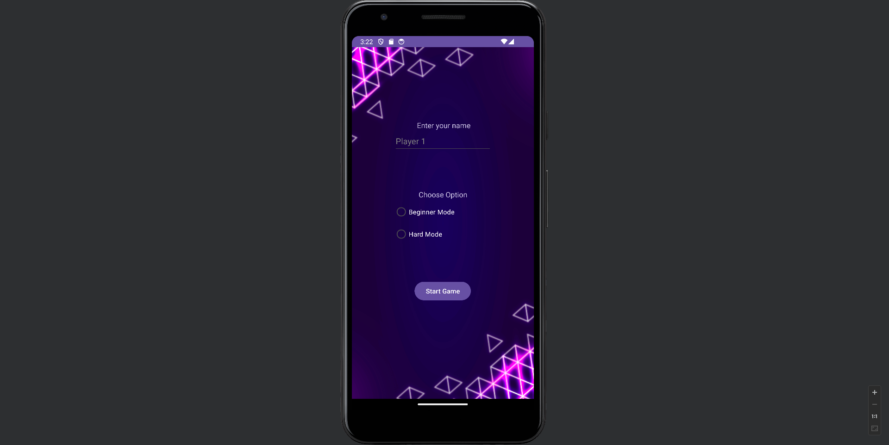
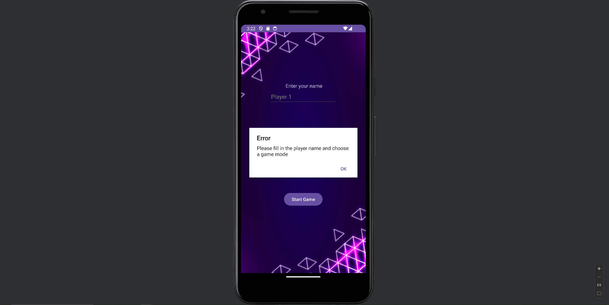
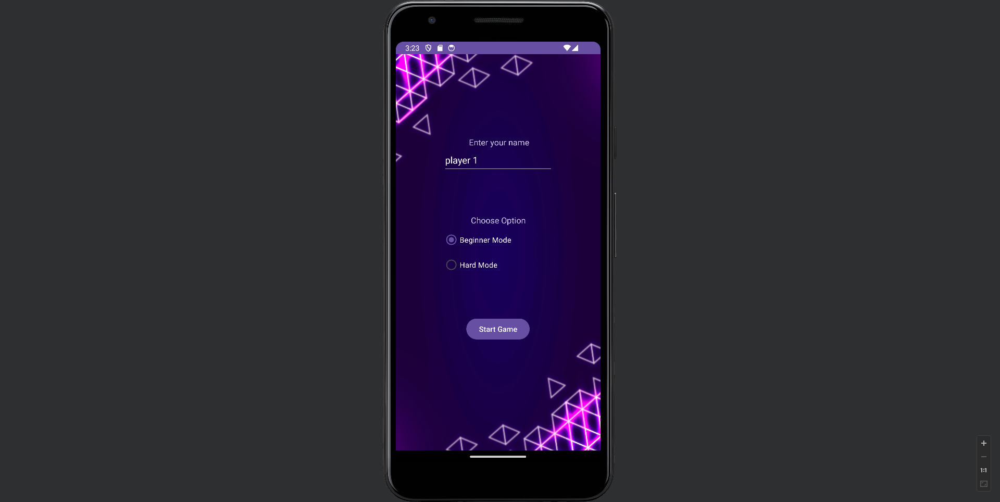
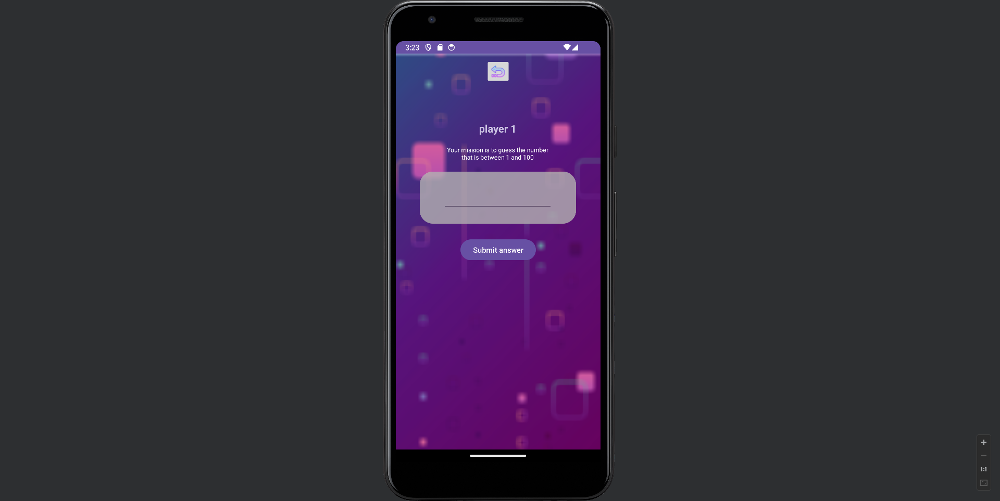
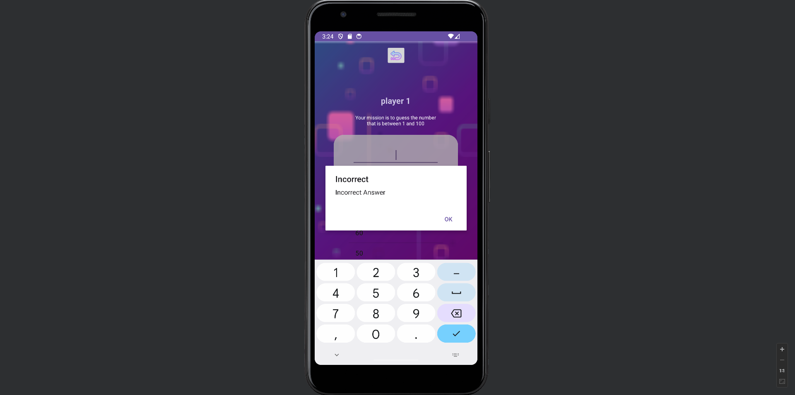
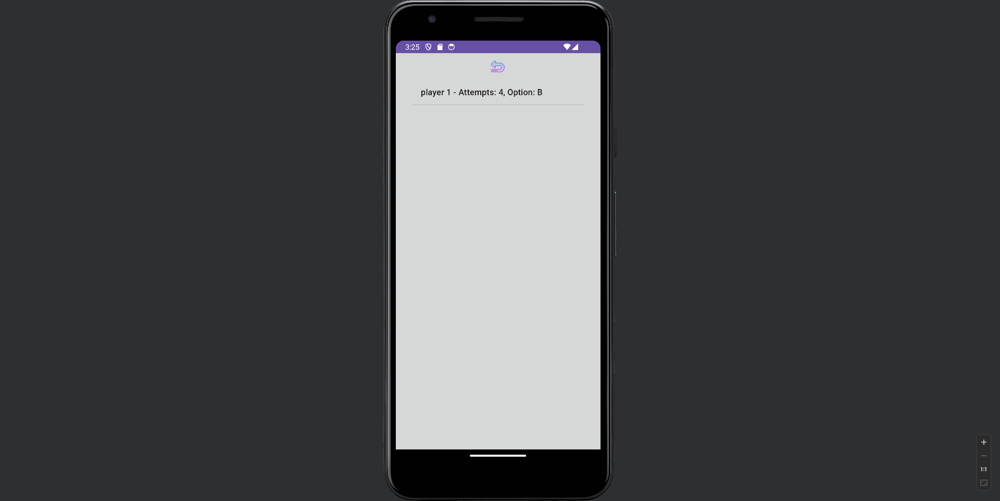
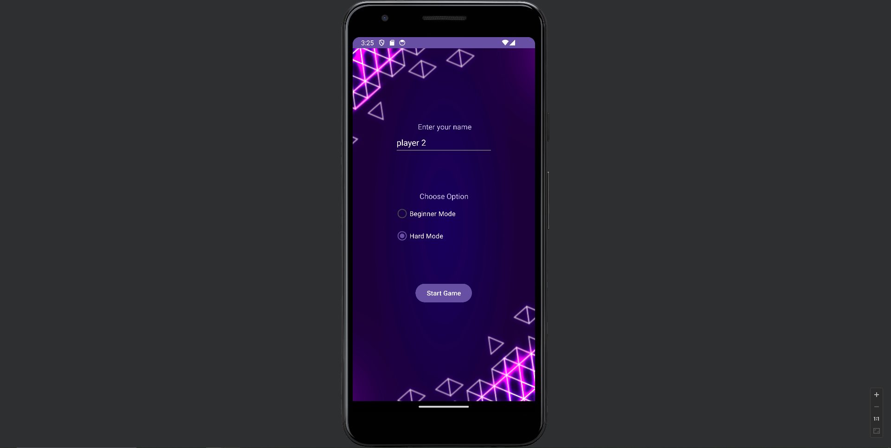
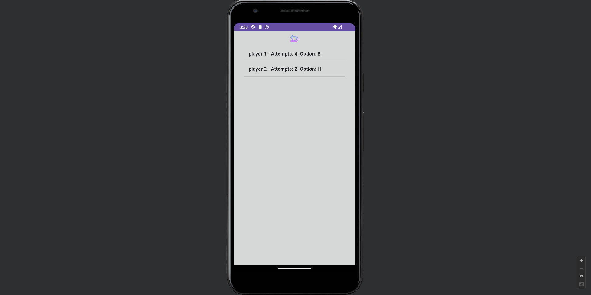

<h3 align="center">Guessing Game</h3>

## About The Project
The Guessing Game is a simple and interactive mobile application built with Kotlin

## Features
- Players can enter their name and choose their preferred game mode
- Scores  are saved, allowing players to track their progress

### Game Modes

#### Beginner Mode
- In this mode, players can take their time to guess the correct number
- The game displays the entire history of their attempts
- There's no time limit, so players can play relaxed

#### Expert Mode
- Expert Mode is designed for more adventurous players
- It does not display the history of attempts, providing a more challenging experience
- The game imposes a strict time limit of 20 seconds

### Game Preview
A sneak peek at the home page of the game

Players must enter their name and selecting their desired game mode

For exemple choosing as a name: player 1, and game mode: beginner

Here is the UI after clicking "Start Game"

Players can enter numbers, and if the number is incorrect, alerts will be shown. In the Beginner Mode, all attempts will be listed, allowing players to track their input
 

If the player guesses the correct number, an alert will be displayed

After guessing the correct number, players will be redirected to the score page, where they can view their name, game mode selected and the number of attempts made

Now, let's try the Hard Mode

In Hard Mode, players do not have a list to track their entries. Instead, they face a countdown timer of 20 seconds to make the game more challenging and hints such as "Try a lower value" or "Try a higher value" are provided to assist the player

If the player runs out of time in Hard Mode, an alert will be displayed to indicate it, and the player will be redirected to the home page

If a player correctly guesses the number in Hard Mode, they will receive an alert indicating their success, and they will be redirected to the score page
 

